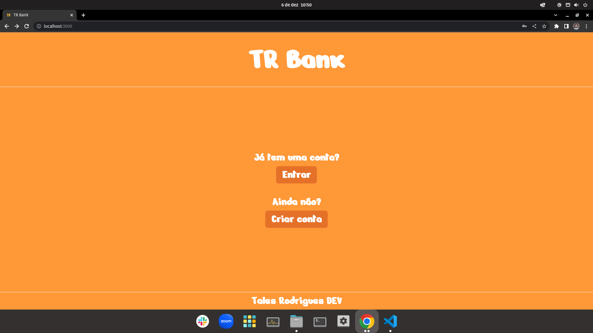
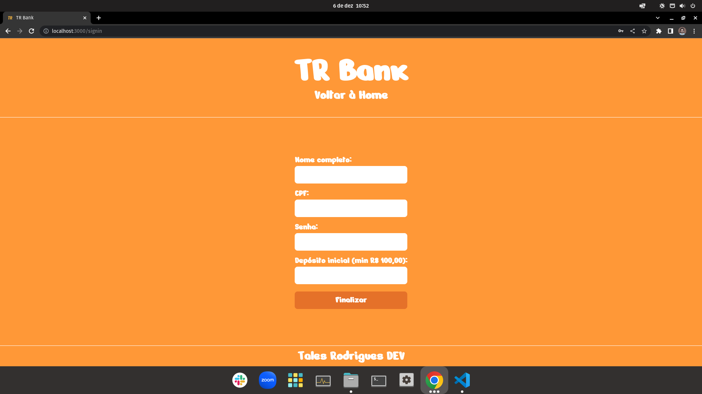
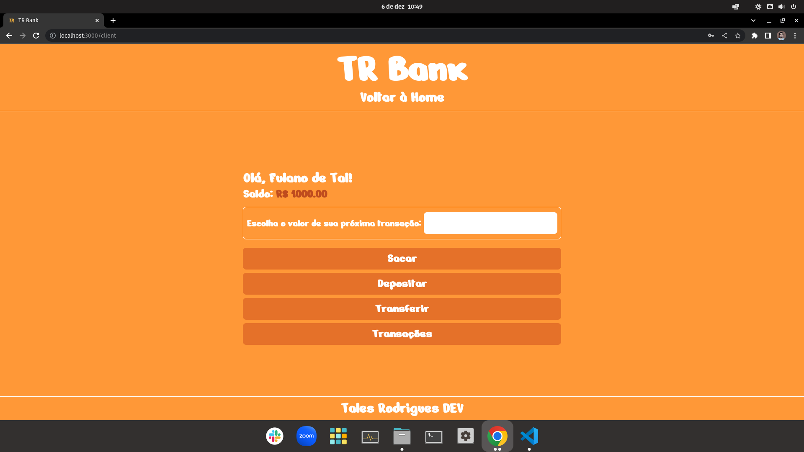
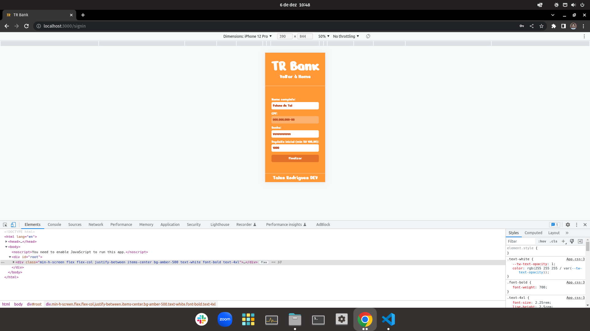
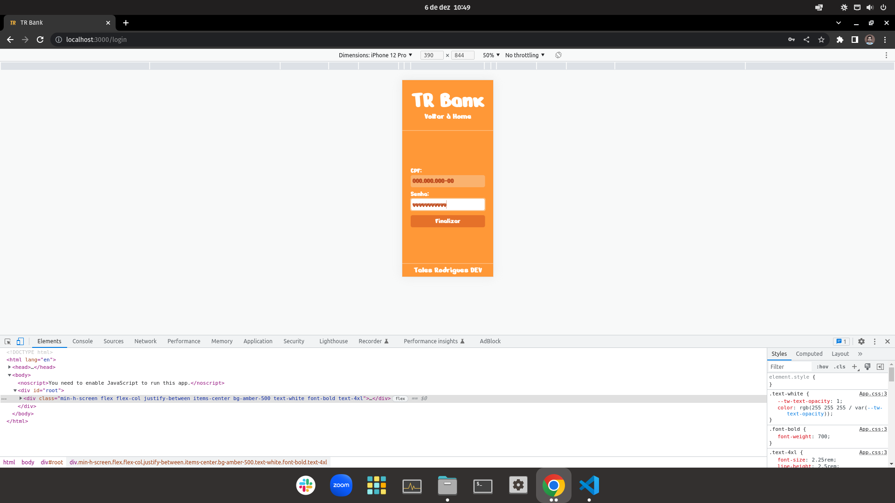
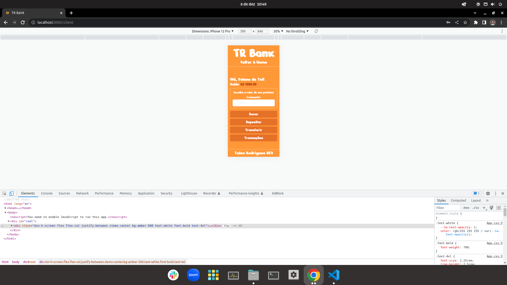

# TR Bank

## Prévia

  
<br />
  

## Tecnologias

### Front-end
1. React (Hooks, Router)
2. Tailwind CSS
3. TypeScript
4. Responsividade

### Back-end
1. Node
2. Express
3. NoSQL (MongoDB)
4. ODM (Mongoose)
5. Docker (Dockerfile, Docker-Compose)
6. TypeScript
7. JWT

## Utilização

1. Clonar o repositório

```
git clone git@github.com:talesrodriguesDEV/trbank.git
```

2. Entrar no diretório do projeto

```
cd trbank
```

3. Inicializar o back-end

```
cd backend
docker-compose up
```

4. Inicializar o front-end

```
cd frontend
npm install
npm start
```
